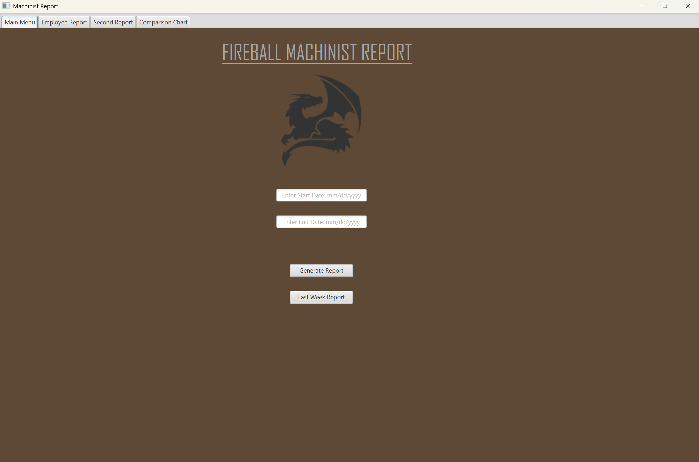
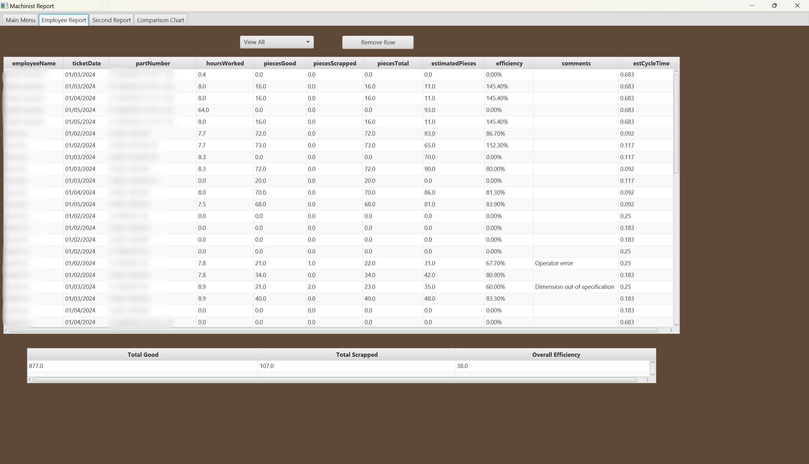
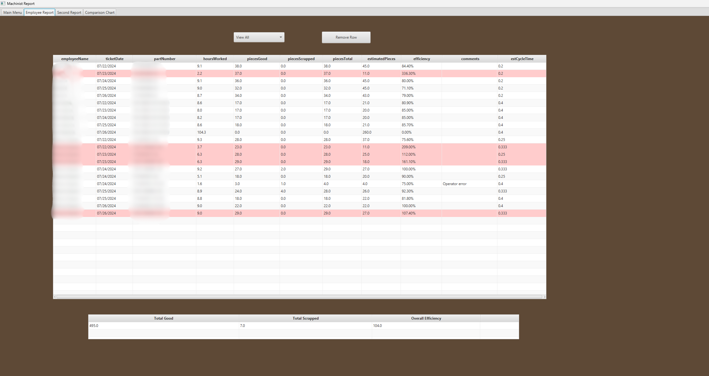
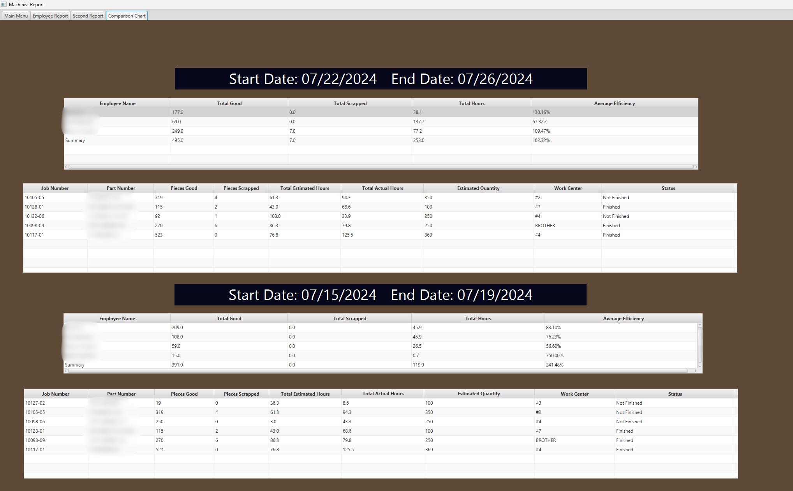
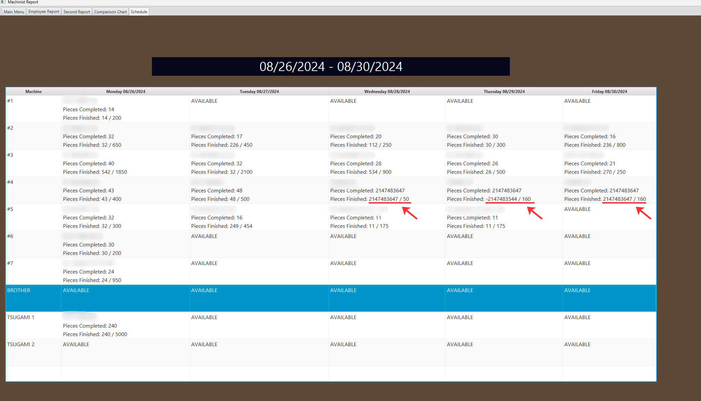

# JobBOSS Machine Shop Efficiency System

JavaFX-based machine shop efficiency reporting system built on the JobBOSS API to calculate machinist performance and bonus metrics.

This application is the Java implementation of a machine shop weekly report that began as a Python prototype. 
It was built to pull machine shop production data from JobBOSS, transform it into an editable reporting format, compare reporting periods, 
and use it as a tool to determine bonuses/performance from the machinists.

---

## Background

**Strong Hand Tools | Santa Fe Springs, CA**  
**Programmer Analyst | June 2023 – January 2025**

The development followed two major phases:

1. **Python prototype**
   - validated API access patterns
   - tested the reporting workflow
   - proved the bonus/efficiency calculation model

2. **Java production implementation**
   - restructured the reporting logic into a maintainable application
   - added a JavaFX user interface for a cleaner UI appearance 
   - supported in-app editing, filtering, comparison views, and richer UI workflows

---

## Core Features

## 1. Date-Based Report Generation


The main menu provides two reporting entry points:

### Manual date range generation
Users can enter:
- start date
- end date

The app then generates a report for that selected window. The secondary report will take into account the first time frame and provide an equal
day range prior to the first report.

### Last week quick report
The application also includes a convenience action to automatically generate a report for the last full Monday–Friday work week.
This supports the expected use case of checking the prior week's performance as the default choice.

---

## 2. JobBOSS API Integration

The application uses the JobBOSS REST API as the source for shop-floor production activity.

### Data retrieval workflow
The reporting engine follows a multi-step data pipeline:

1. authenticate API user (JobBOSS)
2. request time ticket details for each machinist across the selected date range
3. extract job numbers from time ticket records
4. request part numbers from order routings using those job numbers
5. request operator codes and cycle times using the part numbers
6. combine those results into a final normalized reporting dataset

### Why this mattered
The production data needed for efficiency reporting was not available in a single endpoint. Many of the data required (cycle times, pieces completed) 
had to be called through different API calls, so separating each extraction into steps was essential to create the report tables.

---

## 3. Dual-Period Reporting


One of the major features of this application is the comparison to the prior time frame performance.

After the primary report is generated, the application calculates a second, prior comparison period based on the same duration and weekday alignment.
That second report is used for the comparison tab later in the UI.

### Why this is useful
Instead of looking at a single reporting period in isolation, users can compare machinists' output across two aligned date windows and identify performance changes over time.

---

## 4. Employee Report Tab

The **Employee Report** tab is the primary detailed reporting view.

It displays row-level production data for the selected reporting period.

### Columns shown in the report
The report includes fields:
- employee name
- ticket date
- part number
- hours worked
- pieces good
- pieces scrapped
- pieces total
- estimated pieces
- efficiency
- comments
- estimated cycle time

### What this tab is used for
This tab acts as the main review and correction workspace for production data.

Users can inspect:
- which part was worked on
- how many good pieces were completed
- scrap counts
- expected output
- resulting efficiency value

---

## 5. In-App Editing Features

One of the strongest features in this application is that the report is not treated as static output.
Several fields are editable directly inside the JavaFX table.

### Editable fields
Based on the current implementation, users can edit:
- hours worked
- pieces good
- pieces scrapped
- comments

### Dynamic recalculation behavior
When editable values are changed, the application automatically recalculates dependent metrics such as:
- pieces total
- estimated pieces
- efficiency
- hoursWorked 

This turns the report into an interactive review tool rather than a one-time export.

### Why this matters
Real shop data often needs human adjustment.  
This feature makes it possible to:
- clean up edge cases
- test corrected assumptions
- immediately see the impact of changes on efficiency metrics

This report system can also flag potential inconsistencies by marking data with abnormal efficiencies (>100%).
This makes it easier to catch data that was misreported and has to be modified.



---

## 6. Row Removal Workflow

The Employee Report and Second Report tabs both support removing selected rows.

### Why remove rows?
This is useful when:
- a row should not be part of the analysis
- a ticket is invalid
- a duplicate or irrelevant operation appears
- the user wants to adjust the report to match business rules

The table updates after row removal, and summary values are recalculated accordingly.
This feature is very important as it was a common occurrence that employees may accidentally report blank data that will show up during 
table generation. This inevitable occurrence has to be corrected and easily dealt with to ensure clean data. 

---

## 7. Filtering by Employee

The Employee Report tabs support filtering by machinist name.

### Workflow
A choice box is populated with:
- `View All`
- unique employee names present in the report

Selecting a specific employee filters the table to show only that machinist’s records.

### Why this matters
This makes the app useful for both:
- full-shop reporting
- individual machinist review

---

## 8. Aggregate Summary Tables

Each report tab includes a bottom summary table that aggregates key metrics for the currently displayed dataset.

### Summary values
The aggregate section calculates:
- total good pieces
- total scrapped pieces
- overall average efficiency

### Why it matters
This gives users a quick performance summary without manually totaling the detailed report rows.
This also provides a quick view of unique employee metrics.

---

## 9. Comparison Chart Tab


The **Comparison Chart** tab is designed to compare employee-level performance across the two report periods.

### Top tables
- summarizes the first reporting period
- includes job number completion progress based on the reporting period

### Bottom tables
- summarizes the second reporting period
- includes job number completion progress based on the reporting period

### Per-employee metrics shown
Each comparison table includes:
- employee name
- total good pieces
- total scrapped pieces
- average efficiency

### Summary row
- a summary row is also appended to the bottom of the comparison data to provide whole-table totals/averages.

### Why this matters
This feature turns the application from a simple report viewer into a period-over-period performance comparison tool. It also provides
information on scheduled jobs that are still in progress or have been completed, to monitor for future parts to be assigned onto machines.

It supports questions like:
- who improved from one week to the next?
- did average efficiency increase or decrease?
- which employees had the most output vs the expected during each reporting window?

---

## 10. JavaFX UI Architecture

The application is structured around JavaFX and FXML.

### Main UI components
- `HelloApplication.java` — launches the JavaFX application
- `MainScene.fxml` — declares the UI layout
- `MainSceneController.java` — handles UI behavior, events, filtering, editing, report generation, and comparisons

### UI layout
The current FXML layout includes:
- Main Menu
- Employee Report
- Second Report
- Comparison Chart
- Schedule

### Design direction documented in repository images
The `images/` folder also documents UI progression and additional tab concepts explored during development, including:
- prior week views
- comparison design iterations
- next week scheduling / predictive scheduling 

This repo includes screenshots of later added features; the most up-to-date project is not included.
The latest project was saved and transferred to a different desktop, which I no longer have access to.

---

## 11. Data Model Classes

The project includes a small set of focused model/helper classes that support cleaner table rendering and calculations.

### `ReportRow`
Represents a row in the detailed production report.

It stores:
- identifying fields
- work metrics
- calculated fields
- bound recalculation behavior

This class is for the editable report workflow.

### `AggregateData`
Represents summary metrics shown in the lower aggregate table.

### `EmployeeReport`
Represents employee-level aggregated comparison data for the comparison tables.

### `PercentageTableCell`
Custom JavaFX table cell for rendering efficiency values as formatted percentages.

---

## 12. Screenshot and UI Progress Documentation

The repository includes an `images/` directory that documents both baseline templates and feature progression.

### Template images
The `images/templates/` folder shows the initialization layout for the application:
- main menu
- employee report
- prior week
- comparison view

### Progress images
The `images/progress/` folder documents iteration history for:
- employee report
- comparison chart
- prior week
- next week scheduling

---

## 13. Next Week Scheduling / Predictive Scheduling

The repository includes screenshots for a **next week scheduling** implementation under the project images.

This concept was to take in the current scheduling, check for finished jobs, and from then on assign future jobs to each machine based on 
expected pieces to be completed day by day.

### Why it matters
That application was being expanded from an employee metric view to a predictive scheduling system that knew which parts could be done
or were assigned to each machine. This would then create an expected job completion timeline week by week.

---

## Known Bug / Edge Case: Cycle Time Overflow

One of the screenshots shows a bug where the **Pieces Finished** field displayed an abnormally large integer value:



### What this value indicates
This is the maximum value of a signed 32-bit integer in Java

### Most likely cause
Based on the calculation logic, this bug is most likely related to:
- missing cycle time data
- cycle time being `0`

### Why the bug is important
It highlights the need for:
- defensive validation of routing data
- safeguards around missing cycle times
- zero-value protection

### Why include this in the project
- awareness of real-world production data quality problems
- understanding of numeric edge cases
- the kinds of issues that emerge when expected-output calculations depend on external operational data

I included this image as progress of the scheduling system I was implementing. As stated previously, this repo is not the most up-to-date version, so the fix can't be shown
on this project. However, my approach to this bug was to check the part numbers associated with this overflow bug and check their cycle times. As the only possible scenarios for
this overflow would have to be a divide by 0 or an infinitely small number. This was a bug that was not fixed in the project itself, but was used to make corrections on the 
JobBoss system itself. Ensuring all part numbers have their correct associated cycle times guarantees no failure when making an API call for that information.

---

## Project Structure

```text
src/
  main/
    java/
      com/machinist/machinist/
        AggregateData.java
        EmployeeReport.java
        HelloApplication.java
        HelloController.java
        Main.java
        MainSceneController.java
        PercentageTableCell.java
        ReportRow.java
        machinist.java
    resources/
      com/machinist/machinist/
        MainScene.fxml
        hello-view.fxml
        logo.png

images/
  templates/
  progress/


