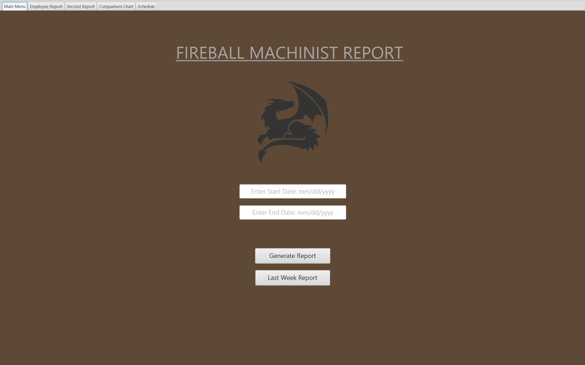
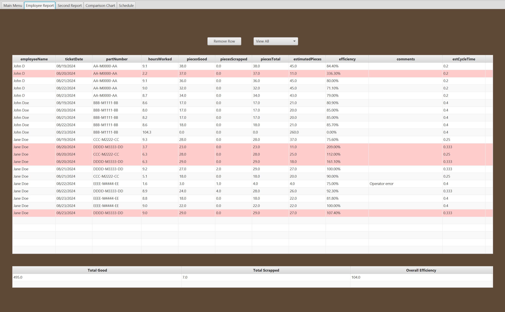
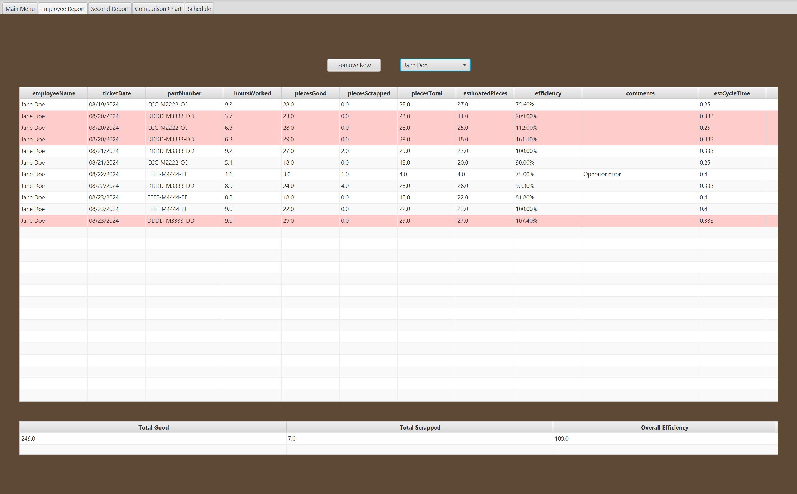
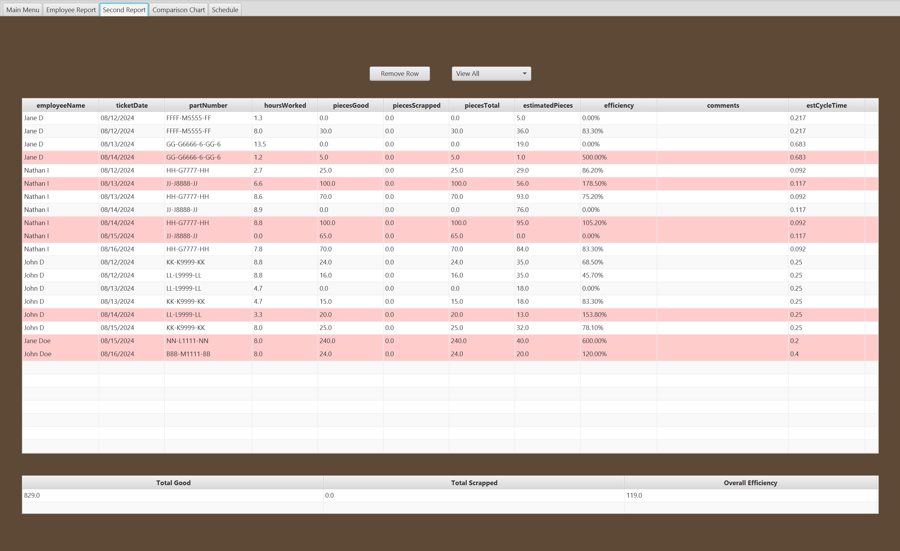
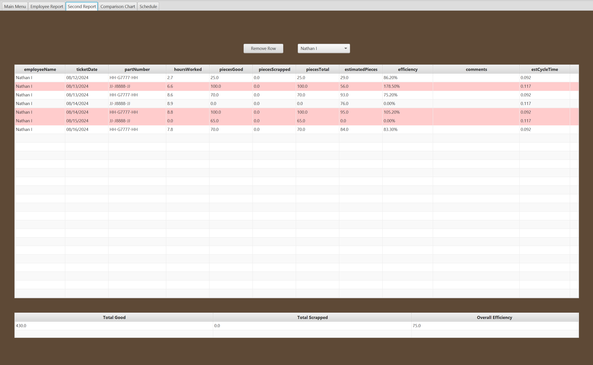
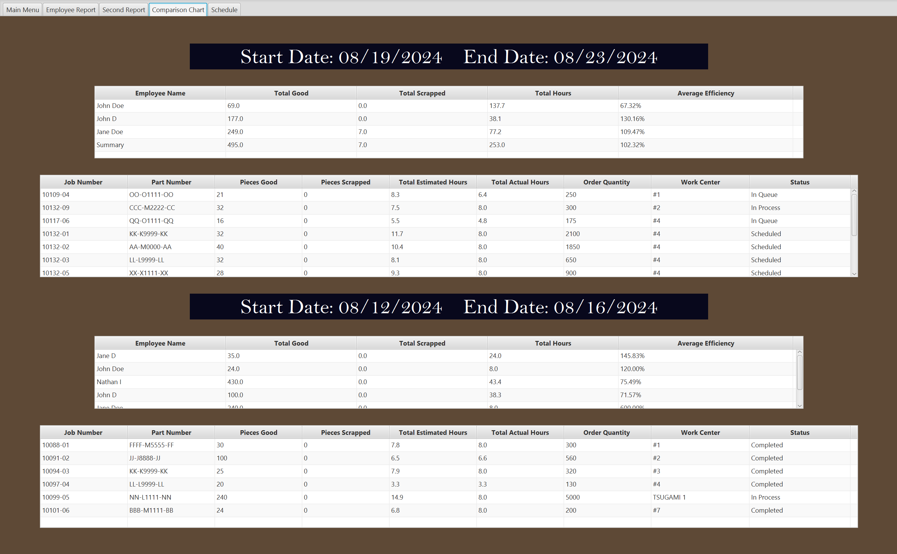
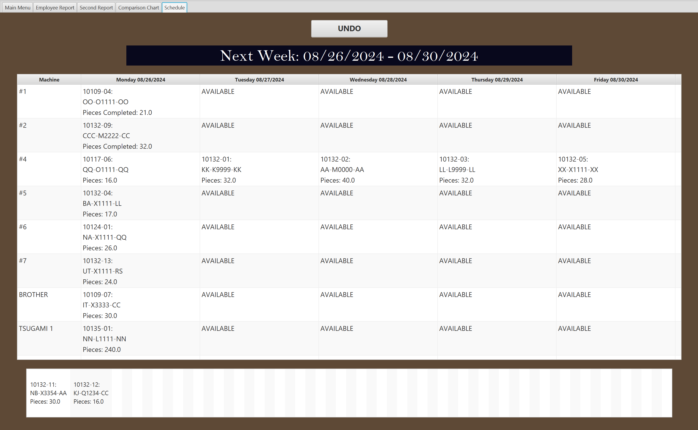
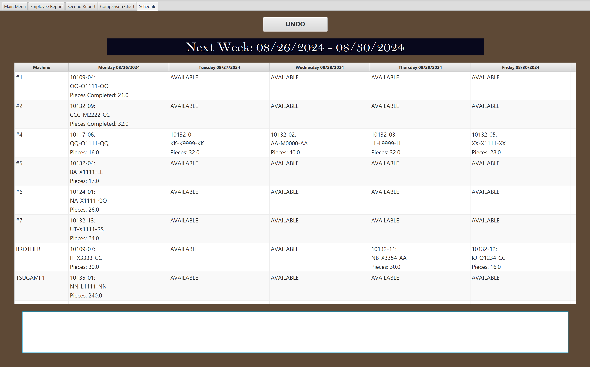

# JobBOSS Machine Shop Efficiency System

JavaFX-based machine shop efficiency reporting system built on JobBOSS API to generate machinist 
performance reports, compare aligned reporting periods, and 
preview next-week machine scheduling in a single desktop application.

This repository contains the finalized Java implementation of the project. What began as a reporting concept 
and prototype evolved into a multi-tab JavaFX system that supports live API-backed report generation, editable 
report review, comparison analytics, job-level production tracking, predictive scheduling, and a preloaded demo 
dataset so the full UI can be reviewed.

---

## Background

**Strong Hand Tools | Santa Fe Springs, CA**  
**Programmer Analyst | June 2023 – January 2025**

The project was built around a real reporting need inside a machine shop workflow: production data 
existed in JobBOSS, but it was not presented in a way that made weekly efficiency review, 
prior-period comparisons, easy to perform.

The development moved through two stages:

1. **Reporting prototype and workflow validation**
   - confirmed that the required production data could be pulled from JobBOSS
   - verified how time-ticket, routing, and order-routing information had to be combined
   - established the efficiency/expected-output calculations

2. **JavaFX production application**
   - converted the reporting process into a desktop application with a dedicated user interface
   - added editable tables, employee filtering, summary tables, comparison tables, and scheduling views
   - expanded the application from a single report screen into an interactive and editable tool 

The finalized application is designed to answer several practical questions in one place:

- What did machinists produce during a selected reporting window?
- What should the expected output have been based on cycle times and hours worked?
- How does this period compare to the prior aligned period?
- Which jobs are completed, still in progress, or still scheduled?
- What does the next week’s machine schedule look like based on current work center activity?

---

## Core Features

### 1. Date-Based Report Generation
The application supports two primary ways to generate production reports:

- **Manual date range generation** - start and end date input fields
- **Last week quick generation** - a dedicated button that automatically selects the prior full Monday–Friday work week

Once the primary report is generated, the application automatically computes a prior-period comparison range based on the same date span and weekday alignment. This makes the second report a true comparative period rather than a manually guessed date window.

### 2. JobBOSS API Integration
The reporting engine is driven by JobBOSS REST API calls. The final report is not retrieved from a single endpoint; instead, the application builds it through a multi-step data pipeline:

1. authenticate into JobBOSS
2. request time-ticket detail records for the selected employees and date range
3. extract job numbers from time-ticket activity
4. request part numbers from order routings
5. request operator codes and cycle times from routings
6. derive estimated pieces from hours worked and cycle time
7. derive efficiency and total pieces fields for final display

The application separates these calls into dedicated data-processing classes so the UI can access normalized table-ready data instead of unfiltered raw JSON.

### 3. Dual-Period Reporting
The system does not stop at one report window. It automatically generates:

- the selected primary report period
- a second aligned prior-period report

That second report feeds both the **Second Report** tab and the **Comparison Chart** tab. 
This makes the application useful not only for single-period review, but also for performance comparison.

### 4. Editable Employee Reporting Workspace
The **Employee Report** and **Second Report** tabs act as editable review tables rather than static exports. 
Users can modify key fields directly inside the JavaFX tables and immediately see the effect on the report.

Editable workflow support includes:

- hours worked edits
- pieces good edits
- pieces scrapped edits
- comments edits
- row removal for invalid or irrelevant entries
- employee filtering through a choice box
- automatic recalculation of totals and efficiency summaries

### 5. Aggregate Summary Calculations
Each report tab includes a bottom summary table that recalculates:

- total good pieces
- total scrapped pieces
- overall efficiency

This makes the screen useful for both row-level review and quick interpretation of the data.

### 6. Comparison Analytics
The **Comparison Chart** tab transforms row-level reporting data into employee-level summaries for both reporting windows. It aggregates:

- total good pieces
- total scrapped pieces
- total hours
- average efficiency

Each period is shown in its own comparison table, and a summary row is appended so both detailed employee performance and total period performance can be reviewed together.

### 7. Job Stage Status
The same comparison screen includes two job-detail tables that show the production jobs associated with each reporting window. These tables surface information such as:

- job number
- part number
- good/scrapped pieces
- total estimated hours
- total actual hours
- order quantity
- work center
- status

This lets the application bridge employee performance reporting and actual job completion visibility.

### 8. Predictive Next-Week Scheduling
The **Schedule** tab extends the project beyond reporting and into planning. It uses current order-routing data to build a work-center-based next-week view with columns for Monday through Friday and rows for machines/work centers.

The scheduling view includes:

- work center assignment logic
- machine/day schedule table
- overflow jobs collected into an extra items list
- drag-and-drop placement into available schedule cells
- undo support for schedule changes

### 9. Demo Data 
The finalized repo includes a built-in sanitized demo dataset. On application startup, the controller loads fake report data, fake job detail data, and a fake next-week schedule so the app is immediately populated for review, screenshots, and UI testing.

This preserves the live JobBOSS generation workflow to be tested without compromising sensitive information.

---

## Tech Stack

- Java 17
- JavaFX 17
- Maven
- org.json

---

## Installation & Run

### Prerequisites

- Java 17 installed  
  - [Eclipse Adoptium (Temurin)](https://adoptium.net/temurin/releases/?version=17)  
  - [Amazon Corretto 17](https://docs.aws.amazon.com/corretto/latest/corretto-17-ug/downloads-list.html)  
  - [Oracle JDK 17](https://www.oracle.com/java/technologies/javase/jdk17-archive-downloads.html)  
- Git installed (to clone the repository)
- Maven installed *(optional — Maven wrapper is included)*

---

### Clone the Repository

```bash
git clone https://github.com/NathanIbanez2257/jobboss-machine-shop-efficiency-system.git
cd jobboss-machine-shop-efficiency-system
```

---

### Run with Maven

```bash
mvn clean javafx:run
```

---

### Run with Maven Wrapper (no Maven installation required)

**Windows:**
```bash
mvnw.cmd clean javafx:run
```

**Mac/Linux:**
```bash
./mvnw clean javafx:run
```

---

### Notes

- The application launches with a **preloaded demo dataset** so the full UI can be explored immediately.
- Live JobBOSS API generation remains available for real data usage.
- No manual JavaFX SDK setup is required; dependencies are managed through Maven.

---

## Screenshot Documentation

## 1. Main Menu


The **Main Menu** is the reporting entry point for the application. It presents:

- start date input
- end date input
- **Generate Report** for manual date windows
- **Last Week Report** for automatic prior full-week generation

This screen establishes the report window that drives the rest of the application. 
It is intentionally simple because it acts as the command center for the main reporting workflow.

---

## 2. Employee Report – Primary Reporting Period


The **Employee Report** tab displays row-level production activity for the primary report window. Each row represents a production entry tied to an employee, part, and ticket date, with calculated performance values layered onto that record.

Visible report data includes:

- employee name
- ticket date
- part number
- hours worked
- pieces good
- pieces scrapped
- pieces total
- estimated pieces
- efficiency
- comments
- estimated cycle time

The summary table at the bottom provides values for the currently displayed report rows.

Rows highlighted in *red* visually mark records whose output exceeded the estimated baseline, 
which helps catch misreporting from employees: 
- reporting 0 pieces 
- reporting 0 hours 
- reporting excessive pieces completed in short time span

### Purpose
This image captures the central purpose of the system: transforming JobBOSS production activity into an editable, 
performance-aware report that can be reviewed by managers or analysts.

---

## 3. Employee Report – Review and Adjustment Workflow


The second employee report screenshot documents the tab in active use. 
The table structure is the same, but the use case of the screen is clearer when used this way:

- users can filter the table by employee
- selected rows can be removed
- edited values recalculate dependent fields
- the bottom summary updates based on the current table state

### Purpose
This is the difference between a static report and a production review tool. 
The report can be corrected, narrowed down, and evaluated interactively instead of being 
treated as a fixed export.

---

## 4. Second Report – Prior Aligned Reporting Period


The **Second Report** tab mirrors the structure of the Employee Report tab, but it is populated with the automatically calculated prior-period comparison window.

This screen makes it possible to inspect the comparison period at the same row-level style as the primary report.

### Purpose
The project does not compare only aggregated totals. It preserves the prior period as its own full editable report, 
which means the user can edit the details of the prior period as it is a common occurrence accidental misreporting takes place.

---

## 5. Second Report – Prior Period Editing and Cleanup


The second screenshot for this tab shows the same editing, filtering, and row-management workflow applied to the prior period.

That keeps both report windows functionally equivalent:

- each period can be reviewed independently
- each period can be filtered by machinist
- each period supports row removal and recalculation
- each period feeds a downstream comparison summary

### Purpose
It reinforces that the comparison workflow is grounded in two full reports, not just two automatically generated totals.

---

## 6. Comparison Chart


The **Comparison Chart** tab is where the application becomes a true analytical tool.

The top half represents the primary report window and the bottom half represents the prior-period report window. Each section includes:

- a period label banner with date range
- an employee comparison table summarizing total good, total scrap, total hours, and average efficiency
- a job-detail table showing the jobs associated with that period

### Purpose
This tab connects employee performance and job progression in one screen. It allows a reviewer to compare 
period-over-period output while also understanding which jobs were completed, scheduled, or still active within 
each window.

---

## 7. Predictive Scheduling – Next Week Overview


The **Schedule** tab displays the projected next-week machine schedule as a work-center-by-day table. Each row represents a machine or work center, and each column represents a day in the upcoming work week.

The view includes:

- machine/work center names in the leftmost column
- job/part assignments by day
- explicit `AVAILABLE` placeholders where no job is currently assigned
- an overflow list of jobs at the bottom that did not fit into the first Monday–Friday pass
- an **UNDO** button for schedule adjustments

### Purpose
This is the clearest expression of the project’s expansion from reporting into operations planning. 
The application not only reports what happened; it also helps visualize what should happen next.

---

## 8. Predictive Scheduling – Interactive Placement Workflow


The second schedule screenshot documents the same predictive scheduling concept as a working UI tool.

The bottom overflow list is designed to feed drag-and-drop placement into available cells in the schedule table. This gives the screen two layers of value:

- an automatically generated starting schedule
- a manual adjustment workflow for refining next-week assignments
- takes into account which part numbers are compatible with which machines, ensuring scheduling aligns with the true machine shop system

### Purpose
It shows that scheduling in this project is not just an output table, it is an interactive scheduling surface backed by the same underlying production data pipeline.

---

## Feature Explanations

## 1. Main Application Flow
The application launches through `HelloApplication.java`, which loads `MainScene.fxml`, creates the scene, and opens the desktop UI in full-screen mode. `Main.java` exists as a simple launcher wrapper that delegates to `HelloApplication`.

The interface itself is organized into five tabs:

- Main Menu
- Employee Report
- Second Report
- Comparison Chart
- Schedule

All meaningful application behavior is coordinated inside `MainSceneController.java`.

---

## 2. Controller-Driven Orchestration
`MainSceneController.java` is the operational center of the application.

It is responsible for:

- gathering date inputs from the Main Menu
- generating the main report through the reporting engine
- calculating the prior aligned report period
- generating the second report automatically
- loading job-detail data for both periods
- configuring the employee report tables
- configuring the comparison tables
- configuring the schedule table
- wiring editable cell behavior
- updating summary tables
- applying employee filters
- removing rows from reports
- supporting drag-and-drop schedule interaction
- loading the startup demo dataset

### Primary controller workflows

#### `btnGenerate()`
Handles manual report generation from the selected date range. It:

1. reads the start and end dates from the input fields
2. calculates the second aligned comparison period
3. runs the main report service
4. loads the primary report table
5. loads job-level details for the primary period
6. runs the secondary report service
7. loads the prior-period report table
8. loads job-level details for the prior period
9. updates the comparison labels and future schedule date labels

#### `btnLastWeek()`
Generates the last full Monday–Friday report automatically. In addition to the normal report workflow, it also computes the next-week date window and triggers schedule generation.

#### `loadStaticDemoData()`
Bootstraps the UI on startup with sanitized sample data. It populates:

- the primary employee report
- the prior-period employee report
- the job-detail tables
- the comparison tables
- the next-week schedule
- the date banners and schedule day labels

This is what makes the repository launch into a fully populated interface for demo purposes.

---

## 3. Reporting Engine Implementation
The main reporting engine lives in `machinist.java`.

### What it does
This class builds the employee reporting dataset from JobBOSS data. The process is multi-stage:

1. authenticate through the JobBOSS login endpoint
2. generate all dates between the selected start and end date
3. request time-ticket activity for the configured employee code list
4. fall back between 8 AM and 7 AM timestamps when collecting time-ticket data
5. extract job numbers from the resulting records
6. request part numbers from order routings
7. request operator code and cycle time data from routings
8. calculate estimated pieces
9. calculate efficiency
10. calculate total pieces
11. reorder and trim columns into final UI-ready report rows
12. return the result as a `ReportResult`, which includes both the final row matrix and the list of job numbers used for downstream job-detail reporting

### Why the implementation matters
The report is assembled from separate endpoints because JobBOSS does not provide all of the required performance 
fields in one api call. The value of the class is the transformation layer that converts raw operational data 
into a report table that the UI can use directly.

---

## 4. Row Model and Live Recalculation
Each employee-report row is represented by `ReportRow.java`.

This model uses JavaFX properties and bindings to keep calculated fields live.

### Bound/calculated values include:

- `piecesTotal = piecesGood + piecesScrapped`
- `estimatedPieces = floor(hoursWorked / estCycleTime)`
- `efficiency = floor((piecesGood / estimatedPieces) * 1000) / 10`

Because the table columns are backed by properties, edits made in the table automatically update the report state and refresh dependent calculations.

### Supporting behavior
- hours worked are rounded to the nearest tenth
- calculated values update through property bindings rather than manual recomputation everywhere
- table refreshes and aggregate summaries are triggered after edits

---

## 5. Employee Report and Prior-Period Report Tabs
The two report tabs use the same table structure and controller logic.

### Features implemented in these tabs
- editable cells for hours worked, pieces good, pieces scrapped, and comments
- employee filtering via a choice box populated from the report data
- row removal with validation for no-row-selected cases
- bottom summary table updates whenever data changes
- comparison tables updated when edited values change
- visual row highlighting through `CustomTableRow.java` when actual output exceeds estimated output

### Aggregate logic
`AggregateData.java` stores the bottom-table rollup values for:

- total pieces
- total scrapped
- average efficiency

The controller recalculates these values every time report rows change.

---

## 6. Comparison Chart Implementation
The employee summary model is represented by `EmployeeReport.java`.

This model aggregates row-level data into employee-level totals and averages.

### Stored comparison metrics
- employee name
- total pieces good
- total scrapped
- average efficiency
- total hours

### Comparison processing flow
`updateCompareTopTable(...)` in the controller iterates through report rows, groups them by employee, and builds `EmployeeReport` objects. `addSummaryRow(...)` then appends a final summary record for full-table review.

`PercentageTableCell.java` is used so efficiency values in the comparison tables are rendered as percentage text.

### Job status flow
Below each comparison table, the controller populates a `TableView<JobNumberReport>` using data returned by `JobNumberData.java`.

`JobNumberData.java`:

- deduplicates the report’s job numbers
- requests order-routing detail from JobBOSS
- filters for MILL/LATHE operations
- transforms JSON into job-level report rows
- derives a simplified status column (`Finished` / `Not Finished` in the data layer, plus routed scheduling statuses visible in the demo dataset)

`JobNumberReport.java` then exposes those values to the JavaFX table using typed properties.

---

## 7. Predictive Scheduling Implementation
The next-week scheduling pipeline lives in `NextWeekData.java` and `NextWeekReport.java`.

### `NextWeekData.java`
This class builds the schedule source data by:

1. requesting current order-routings from JobBOSS
2. filtering for MILL/LATHE operations
3. collecting job number, part number, and work center values
4. calculating expected pieces from cycle time data
5. calculating completed/finished counts from order-routing quantities
6. assigning work to machine/work-center buckets using custom routing rules
7. returning a `TreeMap<String, Set<String>>` keyed by machine/work center

The scheduling rules explicitly distribute work across named work centers such as:

- `#1` through `#7`
- `BROTHER`
- `TSUGAMI 1`
- `TSUGAMI 2`

### `setNextWeekData(...)`
Inside the controller, the schedule map is transformed into the Monday–Friday table. The first five items for a machine are assigned to weekday columns. Any remaining items are collected into the bottom `extra` list.

### Drag-and-drop scheduling
The scheduling screen is interactive:

- `drag()` and `day_drag(...)` attach drag-drop behavior to each weekday column
- only cells marked `AVAILABLE` accept dropped items
- dropped items are removed from the overflow list
- the prior value is pushed onto an undo stack
- `undo_button()` restores the last removed overflow entry and frees the schedule cell again

### Why this matters
The schedule tab combines generated scheduling suggestions and manual planning refinement in one view.

---

## 8. Demo Data for Repo
`FakeReportData.java` is what makes the finalized repository self-contained for presentation and review.

It provides:

- current report dates
- previous report dates
- next-week schedule dates
- current report row data
- previous report row data
- current and previous job-detail tables
- a next-week schedule map

This means the application can be opened and demonstrated immediately, even without live API retrieval. At the same time, the real JobBOSS-backed generation workflow remains in place for actual report creation.

---

## Project Structure

```text
JobBOSS Machine Shop Efficiency System/
├── .mvn/
│   └── wrapper/
├── images/
│   ├── comparison_charts.png
│   ├── employee_report_1.png
│   ├── employee_report_2.png
│   ├── main_menu.png
│   ├── predictive_scheduling_1.png
│   ├── predictive_scheduling_2.png
│   ├── second_employee_report_1.png
│   └── second_employee_report_2.png
├── mvnw
├── mvnw.cmd
├── pom.xml
├── README.md
└── src/
    └── main/
        ├── java/
        │   ├── module-info.java
        │   └── com/example/machinistapp/
        │       ├── AggregateData.java
        │       ├── CustomTableRow.java
        │       ├── EmployeeReport.java
        │       ├── FakeReportData.java
        │       ├── HelloApplication.java
        │       ├── HelloController.java
        │       ├── JobNumberData.java
        │       ├── JobNumberReport.java
        │       ├── Main.java
        │       ├── MainSceneController.java
        │       ├── NextWeekData.java
        │       ├── NextWeekReport.java
        │       ├── PercentageTableCell.java
        │       ├── ReportResult.java
        │       ├── ReportRow.java
        │       └── machinist.java
        └── resources/
            ├── META-INF/
            │   └── MANIFEST.MF
            └── com/example/machinistapp/
                ├── MainScene.fxml
                ├── hello-view.fxml
                └── logo.png
```

### Root-Level Files
- **`pom.xml`** — Maven project configuration, dependencies, compiler settings, and JavaFX plugin setup.
- **`mvnw` / `mvnw.cmd`** — Maven wrapper scripts for consistent project builds.
- **`.mvn/wrapper/`** — Maven wrapper configuration files used by the wrapper scripts.
- **`README.md`** — repository documentation for the finalized project.
- **`images/`** — current screenshot documentation used in the README.

### Java Source Files
- **`HelloApplication.java`** — primary JavaFX application entry point that loads the main scene and starts the UI.
- **`Main.java`** — simple launcher wrapper that delegates to the JavaFX application.
- **`MainSceneController.java`** — central controller coordinating report generation, UI behavior, editing, filtering, aggregation, comparison, scheduling, drag-and-drop, and demo-data bootstrapping.
- **`machinist.java`** — core report generation engine that calls JobBOSS endpoints and builds the main employee reporting dataset.
- **`ReportResult.java`** — return wrapper for main report output and the extracted job number list.
- **`ReportRow.java`** — row model for employee report tables with bound calculated fields.
- **`AggregateData.java`** — bottom summary-table model for total pieces, total scrap, and overall efficiency.
- **`EmployeeReport.java`** — aggregate employee summary model used by the comparison tables.
- **`JobNumberData.java`** — job-level reporting engine used to populate the comparison tab’s job-detail tables.
- **`JobNumberReport.java`** — row model for job-detail reporting tables.
- **`NextWeekData.java`** — scheduling engine that builds the next-week machine/work-center map from current routing data.
- **`NextWeekReport.java`** — row model for the Monday–Friday scheduling table.
- **`CustomTableRow.java`** — custom row styling for visually flagging rows that exceed estimated output.
- **`PercentageTableCell.java`** — JavaFX table cell formatter used for displaying percentages cleanly in comparison views.
- **`FakeReportData.java`** — sanitized demo dataset used to preload the application on startup.
- **`HelloController.java`** — default JavaFX starter controller retained from the initial project scaffold.

### Resource Files
- **`MainScene.fxml`** — finalized FXML layout defining the tabbed application UI.
- **`hello-view.fxml`** — starter scaffold FXML retained from the initial JavaFX template.
- **`logo.png`** — application branding asset used by the UI.
- **`META-INF/MANIFEST.MF`** — application manifest metadata.
- **`module-info.java`** — Java module definition declaring JavaFX and JSON dependencies and opening the application package to FXML.
